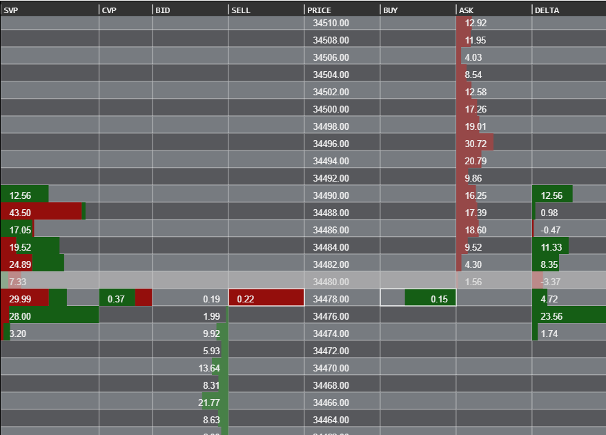

# js-orderbook-canvas
This is a CS50 final project codebase.

#### Video Demo:  <URL HERE>

#### Description:

##### Vanilla HTML5
I dedicate this project to maintaining the low-level spirit of CS50 by developing an order-book visualisation using vanilla Javascript and HTML5, particulary, Canvas. To provide a brief introduction to an order-book visualisation, it is a tool often employed by traders, especially those who participate in futures trading, to analyse market microstructure, orders, trades, and liquidity.     

##### Features

1. Live Level 2 Data: I've utilised Binance futures data, as it is freely available. Other providers, especially for futures and stocks, require a paid subscription.
2. Unlimited Scrolling: You can access all available data for all prices within the scale.
3. Adjustable tickSize (granularity): You have the flexibility to choose your preferred granularity, provided it doesn't exceed the minimum granularity (refer to 'tickSize' in settings.js).
4. Session Volume Profile: This feature 'captures' all traded volumes from the beginning of the session to the current time.
5. Client Volume Profile: Similar To SVP but is reset as per your request. You can do this by double-clicking on any part of the orderbook.
6. Volume delta: This aspect visually represents buying and selling pressure.
7. Market trades: Market trades on the Best Bid or Ask; can also be reset by double-clicking on any part of the canvas.
8. Bars: sizes are relative to the largest bar of the same type, ensuring an accurate scale.
9. Adjustable tab sizes.
10. High-Definition Canvas. 

Please note that all colors and additional settings can be found in settings.js. See the 'Project Limitations' section for more details.

##### Background and Technology

###### Canvas

Initially, I contemplated using SVG (with D3.js). However, after inspecting other web applications with similar purposes, such as futures trading, it became evident that canvas, rather than SVG, is the preferred choice. Having no prior knowledge of canvas, this final project became an opportunity for me to learn something new; relying primarily on MDN documentation.

Additionally, I should mention that while this is a primarily vanilla HTML and JavaScript project, there is an exception. I employed D3's linearScale function for price scale calculations, making it more manageable.

##### Project Limitations

This project exclusively focuses on the visualisation of the order book and does not include editable settings on the user interface for altering instruments, canvas height, colors, etc. However, settings.js contains all the variables required to customize the order book. Furthermore, This project is purely client-side, which in effect, may take a toll on performance, issues related to these are addressed on the performance section below. 

Also, if you are accessing the github page from your phone, please not that it *does not support touchscreen devices* yet.

###### Performance

Lag may occur, especially during highly volatile periods, because of large amounts of data being received, calculated and rendered.

Because of this reason, this implementation of the order book visualisation involves intensive client-side calculations, as well as a lot of data to store, which are typically better suited for backend processing with a database.  

Developing a full-stack application has not been my plan for the final project. Such implementations may be for the future, if I decide to develop this into such. Therefore, I utilised web workers to address these issues and alleviate the client's load. 

One other reason that I suspect to be contributing to lag is the size of the canvas, as well as the frequency of rendering and re-rendering it undergoes.

For this, I used multiple canvases, five to be exact, each serving their own purposes, as a layer of the complete order book, and implemented requestAnimationFrame() for rendering frequently updated canvases.

> Seek, and you shall find.